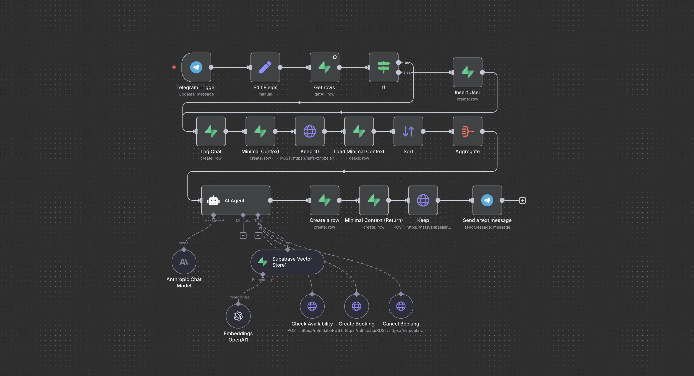
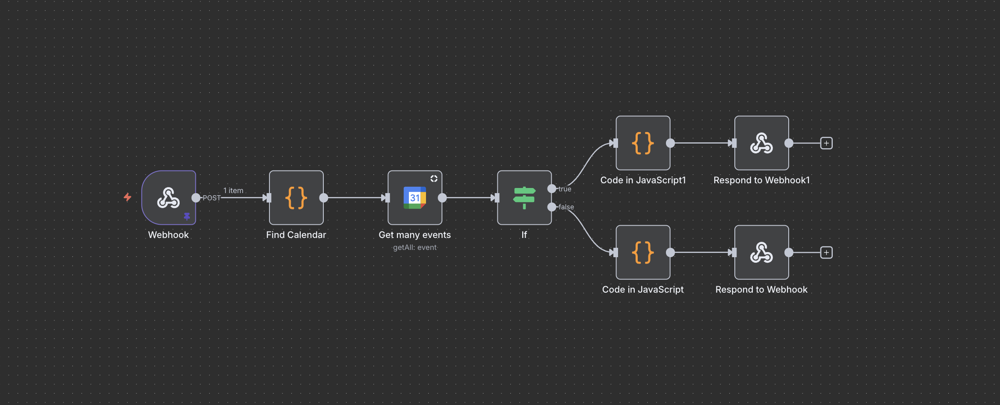
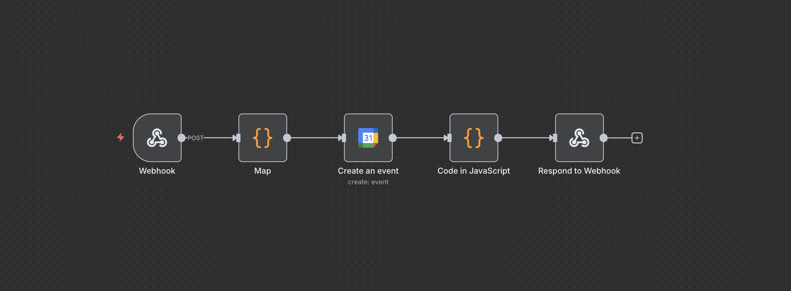
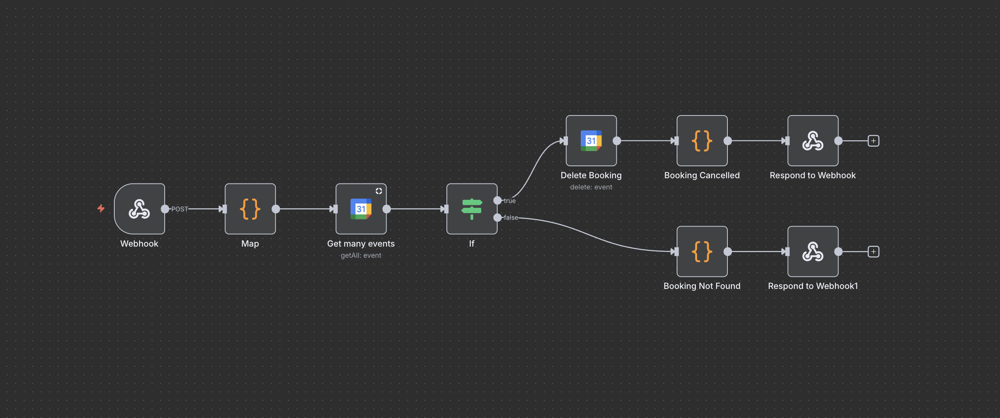

# Verde Valley Stays — AI Concierge Chatbot (n8n)

An AI-powered concierge chatbot built in n8n for a boutique eco-lodging business with six themed properties. Guests interact via Telegram and are handled by an AI agent that can answer questions, check availability, and manage bookings — all in natural conversation.

> This project was also converted into a standalone Python application. [View the Python version here](https://github.com/leighauza/verde-valley-stays-python).

---

## What It Does

Guests message the bot on Telegram as they would a real concierge. The AI understands context across the conversation — remembering names, dates, and preferences — and decides which action to take without the guest ever seeing any of the mechanics.

**Answering property questions**
The bot searches a RAG knowledge base built from property documents to answer questions about amenities, policies, check-in times, pet rules, and anything else a guest might ask.

**Checking availability**
When a guest asks if a property is free on certain dates, the bot queries the property's dedicated Google Calendar in real time and responds with a natural confirmation or alternative suggestion.

**Making bookings**
Once availability is confirmed, the bot collects the guest's name and email (pulling from earlier in the conversation if already provided) and creates a booking event directly in Google Calendar.

**Cancelling bookings**
The bot can find and delete an existing booking by matching the guest name and check-in date in the calendar.

---

## How It's Built

The system is made up of five n8n workflows:

**Document Ingestion** — A Google Drive folder is watched for new files. When a document is added, it is automatically downloaded, split into chunks, embedded via OpenAI, and stored in Supabase as a vector store. Deleting a document from the folder removes it from the knowledge base.

**Three booking sub-workflows** — Check Availability, Create Booking, and Cancel Booking each run as independent webhook-triggered workflows called by the AI agent as tools.

---

## Tech Stack

| Layer | Tool |
|---|---|
| Automation | n8n |
| AI Model | Claude Sonnet (Anthropic) |
| Embeddings | OpenAI |
| Vector Store | Supabase (pgvector) |
| Conversation Memory | Supabase |
| Calendar / Bookings | Google Calendar API |
| Messaging | Telegram Bot API |

---

## Workflow Visuals

**Check Availability**

**Create Booking**

**Cancel Booking**

